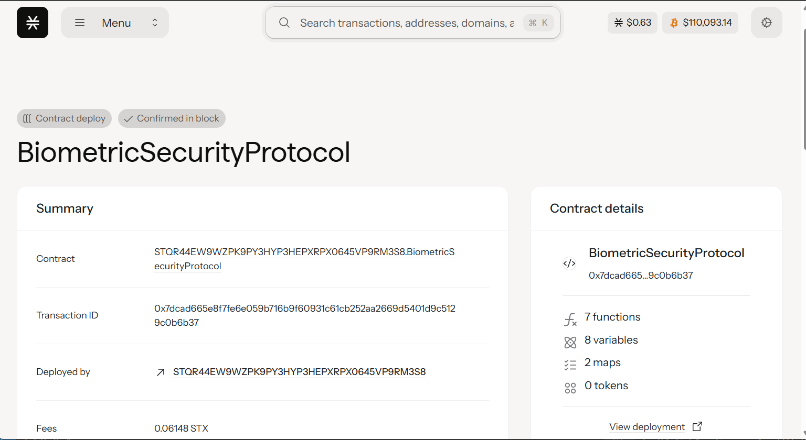

# BiometricSecurity Protocol

## Project Description

The BiometricSecurity Protocol is a revolutionary decentralized authentication system built on the Stacks blockchain using Clarity smart contracts. This protocol enables secure biometric authentication without ever storing actual biometric data on-chain, ensuring maximum privacy and security for users.

The system works by storing cryptographic hash representations of biometric data rather than the raw biometric information itself. This approach provides the security benefits of biometric authentication while maintaining complete privacy and preventing potential data breaches of sensitive biometric information.

## Project Vision

Our vision is to create a trustless, decentralized authentication infrastructure that:

- **Preserves Privacy**: Never stores actual biometric data, only cryptographic representations
- **Ensures Security**: Utilizes blockchain immutability and cryptographic hashing for tamper-proof authentication
- **Promotes Accessibility**: Provides a universal authentication layer that can be integrated across various dApps and platforms
- **Eliminates Central Points of Failure**: Removes the need for centralized biometric databases that are vulnerable to massive data breaches
- **Empowers Users**: Gives individuals full control over their authentication credentials without relying on third-party identity providers

The protocol aims to become the foundation for Web3 identity verification, enabling secure, private, and decentralized authentication for the next generation of blockchain applications.

## Key Features

### Core Functions

1. **register-biometric-pattern**: Allows users to register their biometric authentication by storing a cryptographic hash of their biometric data
2. **verify-biometric-authentication**: Enables users to authenticate by providing their biometric hash for verification against their registered pattern

### Security Features

- **Hash-Based Storage**: Only cryptographic hashes are stored, never raw biometric data
- **Session Management**: Creates temporary authentication sessions with expiration times
- **Verification Tracking**: Maintains statistics on authentication attempts without compromising privacy
- **Immutable Records**: Leverages blockchain immutability for tamper-proof authentication logs

### Privacy Protection

- No personal biometric data is ever stored on-chain
- Hash patterns cannot be reverse-engineered to obtain original biometric data
- User authentication statistics are anonymized and aggregated
- Complete user control over their authentication credentials

## Future Scope

### Phase 1 - Enhanced Security
- **Multi-Factor Authentication**: Integrate additional authentication factors (hardware keys, time-based tokens)
- **Biometric Fusion**: Support for multiple biometric modalities (fingerprint + facial recognition)
- **Advanced Encryption**: Implement homomorphic encryption for enhanced privacy
- **Quantum-Resistant Hashing**: Upgrade to post-quantum cryptographic algorithms

### Phase 2 - Platform Integration
- **dApp SDK**: Develop comprehensive software development kits for easy integration
- **Cross-Chain Compatibility**: Extend support to other blockchain networks
- **API Gateway**: Create RESTful APIs for traditional web application integration
- **Mobile SDK**: Native mobile applications for seamless biometric capture and verification

### Phase 3 - Advanced Features
- **Decentralized Identity (DID)**: Full self-sovereign identity implementation
- **Zero-Knowledge Proofs**: Enable authentication without revealing any information
- **Biometric Templates**: Support for advanced biometric template formats
- **Machine Learning Integration**: Implement adaptive authentication patterns

### Phase 4 - Ecosystem Development
- **Governance Token**: Launch native token for protocol governance
- **Validator Network**: Establish decentralized validation infrastructure
- **Enterprise Solutions**: Corporate and institutional authentication services
- **Global Standards Compliance**: Ensure compliance with international biometric standards (ISO/IEC 19794, 30107)

### Long-term Vision
- **Universal Authentication Layer**: Become the standard for Web3 biometric authentication
- **Interoperability**: Seamless integration across all major blockchain ecosystems
- **AI-Powered Security**: Advanced threat detection and prevention systems
- **Global Adoption**: Support for billions of users worldwide with sub-second authentication times

## Technical Specifications

- **Blockchain**: Stacks (Bitcoin Layer 2)
- **Smart Contract Language**: Clarity
- **Hash Algorithm**: SHA-256 (can be upgraded to quantum-resistant algorithms)
- **Session Duration**: ~24 hours (144 blocks)
- **Gas Optimization**: Minimal storage footprint for cost-effective operations

## Contract Address Details
Contract ID: STQR44EW9WZPK9PY3HYP3HEPXRPX0645VP9RM3S8.BiometricSecurityProtocol

## Getting Started

### Prerequisites
- Stacks wallet (Hiro Wallet, Xverse, etc.)
- Basic understanding of blockchain transactions
- Access to biometric capture device (fingerprint scanner, camera, etc.)

### Usage
1. **Registration**: Call `register-biometric-pattern` with your biometric hash
2. **Authentication**: Use `verify-biometric-authentication` to verify your identity
3. **Session Management**: Check `get-authentication-session` for current session status

## Security Considerations

- Always hash biometric data client-side before sending to the contract
- Use secure random number generation for session management
- Implement proper key management for hash generation
- Regular security audits and updates to cryptographic standards

## Contributing

We welcome contributions from the blockchain and biometric security communities. Please refer to our contributing guidelines for development standards and submission processes.

## License

This project is open source and available under the MIT License.

